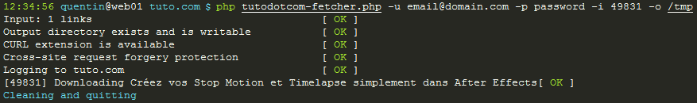

tutodotcom-fetcher
==================

Introduction
------------

tutodotcom-fetcher is a small program that downloads tuto.com tutorial videos.

Requirements
------------

 * CLImate by thephpleague 
   <https://github.com/thephpleague/climate> 
   `composer require league/climate`

 * hls-fetch by Oskar Liljeblad 
   <https://github.com/osklil/hls-fetch> 
   `apt-get install perl openssl libhtml-parser-perl libwww-perl libjson-perl liburi-perl`

Usage
-----

Run `php tutodotcom-fetcher.php -h` for further usage information.

License
-------

This program is free software: you can redistribute it and/or modify
it under the terms of the GNU General Public License as published by
the Free Software Foundation, either version 3 of the License, or
(at your option) any later version.

This program is distributed in the hope that it will be useful,
but WITHOUT ANY WARRANTY; without even the implied warranty of
MERCHANTABILITY or FITNESS FOR A PARTICULAR PURPOSE.  See the
GNU General Public License for more details.

You should have received a copy of the GNU General Public License
along with this program.  If not, see <http://www.gnu.org/licenses/>.
